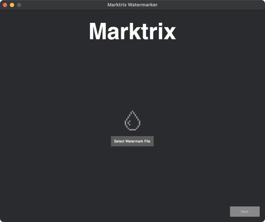
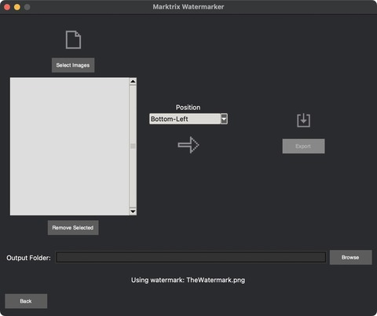

# Marktrix Watermarker

A simple desktop application (for macOS and Windows) to quickly apply a watermark to a batch of images.





## Features

- Batch process multiple images (.png, .jpg, .jpeg, .bmp, .tiff).
- Select a custom watermark (PNG format recommended for transparency).
- Choose watermark position (Bottom-Right, Bottom-Left, Top-Right, Top-Left, Center).
- Preserves original image format where possible (JPEG, PNG, TIFF, BMP, WEBP), falls back to PNG otherwise.
- Automatically adds `(1)`, `(2)`, etc. to filenames to prevent overwriting previous exports.
- Simple two-step interface.

## Download & Installation

You can download pre-built versions for macOS and Windows from the **[Releases Page](link-to-your-github-releases-page)**.

**(You will add the actual link here after uploading the files in Phase 3)**

---

**Instructions for Windows Users:**

1.  Go to the [Releases Page](link-to-your-github-releases-page).
2.  Download the `.zip` file ending in `-Windows.zip` (e.g., `Marktrix-Watermarker-v1.0-Windows.zip`).
3.  Unzip the downloaded file. This will reveal `Marktrix Watermarker.exe`.
4.  Double-click `Marktrix Watermarker.exe` to run the application. No installation is needed.
5.  **Note:** Windows Defender SmartScreen or your antivirus might show a warning on the first run because the app isn't signed. You may need to click "More info" -> "Run anyway" or temporarily allow it in your antivirus software.

---

**Instructions for macOS Users:**

1.  Go to the [Releases Page](link-to-your-github-releases-page).
2.  Download the `.zip` file ending in `-macOS.zip` (e.g., `Marktrix-Watermarker-v1.0-macOS.zip`).
3.  Unzip the downloaded file. This will reveal `Marktrix Watermarker.app`.
4.  (Recommended) Drag `Marktrix Watermarker.app` into your main `/Applications` folder.
5.  **Important First Run:** Because the app isn't from the App Store, you need to **Right-click (or Control-click) the app icon** and select **Open**. A security warning will appear; click the **Open** button on that dialog.
6.  After opening it successfully once, you can run it normally by double-clicking the icon in the future.

---

## Building from Source (for Developers)

If you prefer to run directly from the source code:

1.  Ensure you have Python 3 installed.
2.  Clone this repository: `git clone https://docs.github.com/en/repositories/creating-and-managing-repositories/about-repositories`
3.  Navigate into the project directory: `cd marktrix-watermarker` (or your repo name)
4.  Create and activate a virtual environment:

    # macOS/Linux

    ```bash
    python3 -m venv venv

    ```

    ```bash
    source venv/bin/activate
    ```

    # Windows

    ```bash
    python -m venv venv
    ```

    ```bash
    venv\Scripts\activate

    ```

    ```bash
    source venv/bin/activate
    ```

5.  Install dependencies:
    ```bash
    pip install -r requirements.txt
    ```
6.  Run the application:
    # macOS/Linux
    ```bash
    python3 run_app.py
    ```
    # Windows
    ```bash
    python run_app.py
    ```

## Credits & License

- Icon sources and licenses are listed in the `CREDITS.md` file.
- This project is licensed under the [MIT License](LICENSE).
